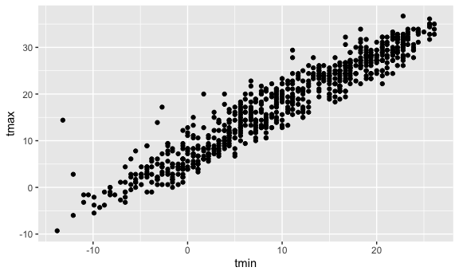
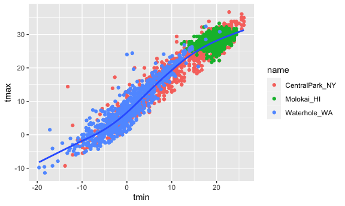
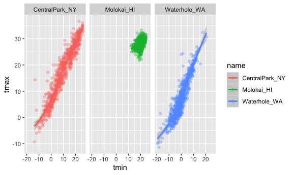
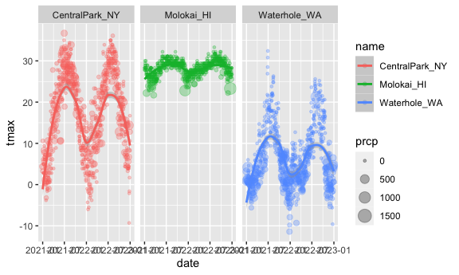
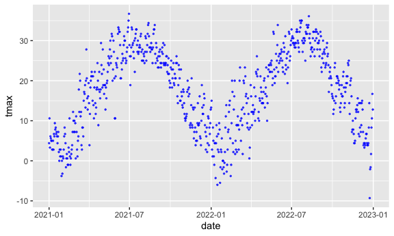
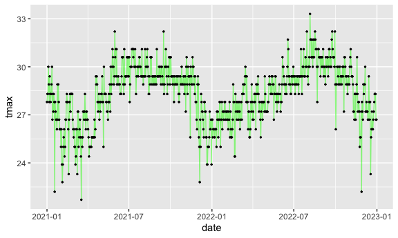
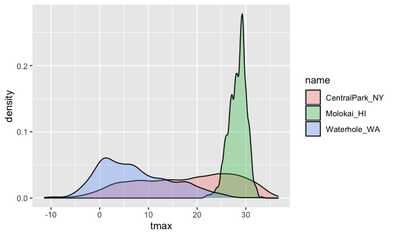
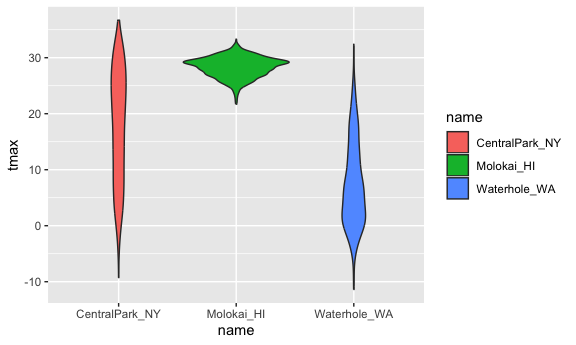

Data Visualization Part 1
================

Initial Libraries

``` r
library(tidyverse)
```

    ## ── Attaching core tidyverse packages ──────────────────────── tidyverse 2.0.0 ──
    ## ✔ dplyr     1.1.3     ✔ readr     2.1.4
    ## ✔ forcats   1.0.0     ✔ stringr   1.5.0
    ## ✔ ggplot2   3.4.3     ✔ tibble    3.2.1
    ## ✔ lubridate 1.9.2     ✔ tidyr     1.3.0
    ## ✔ purrr     1.0.2     
    ## ── Conflicts ────────────────────────────────────────── tidyverse_conflicts() ──
    ## ✖ dplyr::filter() masks stats::filter()
    ## ✖ dplyr::lag()    masks stats::lag()
    ## ℹ Use the conflicted package (<http://conflicted.r-lib.org/>) to force all conflicts to become errors

``` r
library(ggridges)

#Global Markdown Knitting Settings
knitr::opts_chunk$set(
  fig.width = 6,
  fig.asp = .6,
  out.width = "90%"
)
```

Importing Data from NOAA Online Server

``` r
weather_df = 
  rnoaa::meteo_pull_monitors(
    c("USW00094728", "USW00022534", "USS0023B17S"),
    var = c("PRCP", "TMIN", "TMAX"), 
    date_min = "2021-01-01",
    date_max = "2022-12-31") |>
  mutate(
    name = recode(
      id, 
      USW00094728 = "CentralPark_NY", 
      USW00022534 = "Molokai_HI",
      USS0023B17S = "Waterhole_WA"),
    tmin = tmin / 10,
    tmax = tmax / 10) |>
  select(name, id, everything())
```

    ## using cached file: /Users/ZanderDJ/Library/Caches/org.R-project.R/R/rnoaa/noaa_ghcnd/USW00094728.dly

    ## date created (size, mb): 2023-09-28 10:22:06.019273 (8.524)

    ## file min/max dates: 1869-01-01 / 2023-09-30

    ## using cached file: /Users/ZanderDJ/Library/Caches/org.R-project.R/R/rnoaa/noaa_ghcnd/USW00022534.dly

    ## date created (size, mb): 2023-09-28 10:22:19.286532 (3.83)

    ## file min/max dates: 1949-10-01 / 2023-09-30

    ## using cached file: /Users/ZanderDJ/Library/Caches/org.R-project.R/R/rnoaa/noaa_ghcnd/USS0023B17S.dly

    ## date created (size, mb): 2023-09-28 10:22:23.169628 (0.994)

    ## file min/max dates: 1999-09-01 / 2023-09-30

``` r
weather_df
```

    ## # A tibble: 2,190 × 6
    ##    name           id          date        prcp  tmax  tmin
    ##    <chr>          <chr>       <date>     <dbl> <dbl> <dbl>
    ##  1 CentralPark_NY USW00094728 2021-01-01   157   4.4   0.6
    ##  2 CentralPark_NY USW00094728 2021-01-02    13  10.6   2.2
    ##  3 CentralPark_NY USW00094728 2021-01-03    56   3.3   1.1
    ##  4 CentralPark_NY USW00094728 2021-01-04     5   6.1   1.7
    ##  5 CentralPark_NY USW00094728 2021-01-05     0   5.6   2.2
    ##  6 CentralPark_NY USW00094728 2021-01-06     0   5     1.1
    ##  7 CentralPark_NY USW00094728 2021-01-07     0   5    -1  
    ##  8 CentralPark_NY USW00094728 2021-01-08     0   2.8  -2.7
    ##  9 CentralPark_NY USW00094728 2021-01-09     0   2.8  -4.3
    ## 10 CentralPark_NY USW00094728 2021-01-10     0   5    -1.6
    ## # ℹ 2,180 more rows

# Making a Plot

``` r
ggplot(weather_df, aes(x = tmin, y = tmax)) + geom_point()
```

    ## Warning: Removed 17 rows containing missing values (`geom_point()`).


Identifying it through Piping

``` r
weather_df |> 
  filter(name == "CentralPark_NY") |> 
  ggplot(aes(x = tmin, y = tmax)) +
  geom_point()
```


``` r
ggp_nyc_weather = 
  weather_df |> 
  filter(name == "CentralPark_NY") |> 
  ggplot(aes(x = tmin, y = tmax)) +
  geom_point()

ggp_nyc_weather
```



# Editing Plots and Aesthetic Mapping

``` r
ggplot(weather_df, aes(x= tmin, y = tmax)) + 
  geom_point(aes(color = name)) +
  geom_smooth(se = FALSE)
```

    ## `geom_smooth()` using method = 'gam' and formula = 'y ~ s(x, bs = "cs")'

    ## Warning: Removed 17 rows containing non-finite values (`stat_smooth()`).

    ## Warning: Removed 17 rows containing missing values (`geom_point()`).



``` r
#color maps onto points, smooth creates a curve to plot into the line
```

Plot with Facets

``` r
ggplot(weather_df, aes(x = tmin, y= tmax, color = name)) +
  geom_point(alpha = .3) + 
  geom_smooth() +
  facet_grid(. ~ name)
```

    ## `geom_smooth()` using method = 'loess' and formula = 'y ~ x'

    ## Warning: Removed 17 rows containing non-finite values (`stat_smooth()`).

    ## Warning: Removed 17 rows containing missing values (`geom_point()`).



New Plot

``` r
ggplot(weather_df, aes(x= date, y = tmax, color = name)) +
  geom_point(aes(size = prcp), alpha = .3) +
  geom_smooth() +
  facet_grid(. ~ name)
```

    ## `geom_smooth()` using method = 'loess' and formula = 'y ~ x'

    ## Warning: Removed 17 rows containing non-finite values (`stat_smooth()`).

    ## Warning: Removed 19 rows containing missing values (`geom_point()`).



Try assigning a specific color

``` r
weather_df |> 
  filter(name != "CentralPark_NY") |> 
  ggplot(aes(x= date, y = tmax, color = name)) +
  geom_point(alpha = .7, size = .5)
```

    ## Warning: Removed 17 rows containing missing values (`geom_point()`).


If you want to assign color, best to put it in the geom_point for a
particular trend curve Easiest to filter trend of interest ahead of time

``` r
weather_df |> 
  filter(name == "CentralPark_NY") |> 
  ggplot(aes(x= date, y = tmax)) +
  geom_point(alpha = .7, size = .5, color = "blue")
```



``` r
weather_df |> 
  ggplot(aes(x = tmin, y = tmax)) + 
  geom_hex()
```

    ## Warning: Removed 17 rows containing non-finite values (`stat_binhex()`).


``` r
weather_df |> 
  filter(name == "Molokai_HI") |> 
  ggplot(aes(x = date, y = tmax)) +
  geom_line(alpha = 0.5, color = "green") +
  geom_point(size = 0.5)
```

    ## Warning: Removed 1 rows containing missing values (`geom_point()`).



## Univariate Plotting

Histogram

``` r
ggplot(weather_df, aes(x = tmax, fill = name)) +
  geom_histogram(position = "dodge")
```

    ## `stat_bin()` using `bins = 30`. Pick better value with `binwidth`.

    ## Warning: Removed 17 rows containing non-finite values (`stat_bin()`).


``` r
# with these specifications on position not very readable
```

Let’s use a density plot

``` r
ggplot(weather_df, aes(x = tmax, fill = name)) +
  geom_density(alpha = .3, adjust = 0.7)
```

    ## Warning: Removed 17 rows containing non-finite values (`stat_density()`).



Using Boxplots

``` r
ggplot(weather_df, aes(y = tmax, x = name)) + 
  geom_boxplot()
```

    ## Warning: Removed 17 rows containing non-finite values (`stat_boxplot()`).


Violin Plot

``` r
ggplot(weather_df, aes(y = tmax, x = name, fill = name)) + 
  geom_violin()
```

    ## Warning: Removed 17 rows containing non-finite values (`stat_ydensity()`).



Ridge Plot

``` r
ggplot(weather_df, aes(x = tmax, y = name)) +
  geom_density_ridges()
```

    ## Picking joint bandwidth of 1.54

    ## Warning: Removed 17 rows containing non-finite values
    ## (`stat_density_ridges()`).


# Saving and Embedding Plots

Setting a folder directory ahead of time in repositor

``` r
ggp_weather = 
  weather_df |> 
  ggplot(aes(x = tmin, y = tmax)) + 
  geom_point()

ggp_weather
```

    ## Warning: Removed 17 rows containing missing values (`geom_point()`).


``` r
ggsave("Results/ggp_weather.pdf", ggp_weather)
```

    ## Saving 6 x 3.6 in image

    ## Warning: Removed 17 rows containing missing values (`geom_point()`).

Resizing a figure within code chunk for embedding in Markdown File

``` r
ggp_weather
```

    ## Warning: Removed 17 rows containing missing values (`geom_point()`).


``` r
ggp_weather
```

    ## Warning: Removed 17 rows containing missing values (`geom_point()`).


